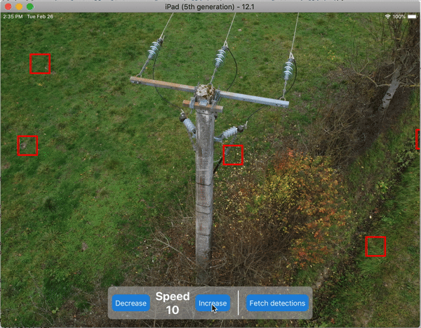

# Mobile internship exercise

In this exercise your are asked to build a simple app which simulates the connection to a drone. The app should:

- Show a picture in the background simulating the video feedback of the drone
- Show the speed of the drone, and enable the user to change it. We will use a very simple simulation where the drone changes its speed instantly as soon as the user has commanded it
- Display defect detections on the screen. These will be simulated by displaying fixed length red squares on top of the background image.
- Finally the fetching of these detections will be simulated by randomly changing the number of detections and their location on the image

You can see here an example of the functionalities the app should have:



We have divided the deliverables in three parts, we ask you to go as far as you can go. If you are blocked at some point ask us questions, it's better to ask and be able to go further in the exercise.

## 1 - Basic deliverable: app with drone speed

This is the most basic deliverable we expect from you. It includes the app with the background image and with the drone speed (and the buttons to set it). Hereafter are some guidelines to help you on this.

### Init app with Expo

We ask you to use [Expo](https://expo.io/learn) in order to develop the app. Expo is a toolchain built on top of React-Native that makes creating apps really easy as you will be able to see. Basically follow these steps in order to have your app up and running (and if you block here be sure to check their website which has very good documentation):

- Install Expo CLI `npm install expo-cli --global`
- Create you project `expo init sterblueExercise`
- Launch your project:

```bash
cd sterblueExercise
expo start
```

- Launch app in your phone or in simulator (if you want to launch in your phone you will need to install the Expo client from the App Store of Google Play).

### Create your first component

- Open your project folder in your IDE and create the following path which will be the main view of the app `src/components/index.js`
- Edit the created file and copy/paste this:

```JS
/* @flow */
import * as React from "react";
import { View, Text } from "react-native";

class MainView extends React.Component {
  render() {
    return (
      <View
        style={{
          width: "100%",
          height: "100%",
          flexDirection: "column",
          justifyContent: "center",
          aligntItems: "center"
        }}
      >
        <Text style={{ textAlign: "center" }}>Hi from my app</Text>
      </View>
    );
  }
}

export default MainView;
```

- Edit the file `app.json` and change the `orientation` field from `portrait` to `landscape`. This will make sure the app is runned in `portrait` mode.
- Now open the file `App.js` located at the root of the project folder and edit it in order to import our main view and render it:

```JS
import React from "react";
import MainView from "./src/components";

export default class App extends React.Component {
  render() {
    return <MainView />;
  }
}
```

- Now in your phone/simulator you should see your app running in portrait mode with a text located in the center of the screen saying "Hi from my app"

### Reaching the first deliverable

Now that you have your app up and running and you know how to create React Components you can extrapolate this to create:

- A component that will show the background image (take the image called `pylon.jpg` located in the `assets` folder in this repo)
- A component that will contain the Text showing the drone speed and the two buttons for being able to change it
- The speed of the drone will be stored in the state of this last component, and will be initialized to 10. Then it can be changed using the React Component function `this.setState()`. Be sure to follow [the React documentation](https://reactjs.org/docs/state-and-lifecycle.html#using-state-correctly) on how to use the internal state of a component correctly.
- You can use any component from any library that you want for reaching the final result, although it is possible to make everything with the components that are packed with `react-native` (you can check all the available components [on the left side bar here](https://facebook.github.io/react-native/docs/getting-started)). In the GIF above the only component which is not from the `react-native` library is the `Increase`/`Decrease` button, which is from the [`react-native-elements`](https://react-native-training.github.io/react-native-elements/docs/overview.html) library.

The first deliverable should look like this:


## 2 - Advanced deliverable: display AI detections

In this part you should display AI detections. We are going to simulate that we have fetched these detections from the database, and that these are represented by this:

```JSON
{"detections": [{ "top": "50%", "left": "50%" }, { "top": "25%", "left": "30%" }, { "top": "60%", "left": "10%" }]}
```

Basically the `detections` key contains an array of objects, each of these representing a `Detection`. As you can see one `Detection` is defined by its position on the screen: we have defined it by the distance to the top and left part of the screen, in percentage of the total screen size.

In the example GIF that you have at the top of this document the detection component is only a `View` component from the `react-native` library with the style set as follows:

```JS
<View
  style={{
    borderWidth: 4,
    borderColor: "red",
    backgroundColor: "transparent",
    width: 50,
    height: 50
    //Here you should put other styling properties for positioning the Detection depending on its properties
  }}
/>
```

It is really important that you take into account the fact that **we are going to test your app by changing the number of detections and its position** so you can not just hard code the position of the three detections that we set above.

In order to ensure that your component follows the required behavior here are some guidelines:

- Put the detections object in the component state
- Perform a [`map`](https://gist.github.com/jfmengels/6b973b69c491375117dc#_mapiteratee-collection) on `this.state.detections` in order to display. We strongly encourage you to use the `map` function from `lodash/fp` instead of a `for` loop.

After this the second deliverable should look to something like this:


## 3 - Sick deliverable: simulate fetching of AI detections

Finally, we are going to simulate fetching of AI detections from the DB (and assuming that each time we fetch them the detections have changed). Here are some guidelines on how to reach this:

- Create a button component for "fetching" the detections
- When the button is pressed, use `setState` in order to change the `detections` key.
- Every time the user presses on the `Fetch detections` button, the number of detections should vary randomly in the [0,10] range, and their positions should as well randomly change (in the [0%, 100%] range).

By implementing this you should reach the same behavior as the GIF at the top of this document.

## 4 - Final claims and useful documentation

As you can see the exercise is separated into three different deliverables, try to go as far as you can go. Of course ideally you are able to finish this exercise, but if it's not the case don't worry, we'll take into account other parameters to evaluate what you will deliver:

- Your past experience on this field: if it was completely new to you but yet you managed to do a fair amount of work
- The **quality of your code** and how you have organized it (code splitting, comments, consistent naming convention...)
- Your way of working: if you were able to perform most of the problem finding solutions to your problems on your own or if you needed much guidance.

Please if you have any questions or need of clarification don't hesitate to contact me [ignacio.carnicero@sterblue.com](mailto:ignacio.carnicero@sterblue.com).

Here are some useful links where you'll find all that you need for performing this project:

- [React-native documentation](https://facebook.github.io/react-native/docs/getting-started)
- [React documentation](https://reactjs.org/docs/getting-started.html)
- [Expo documentation](https://docs.expo.io/versions/latest/)
- [React-native-elements documentation](https://react-native-training.github.io/react-native-elements/docs/overview.html)
